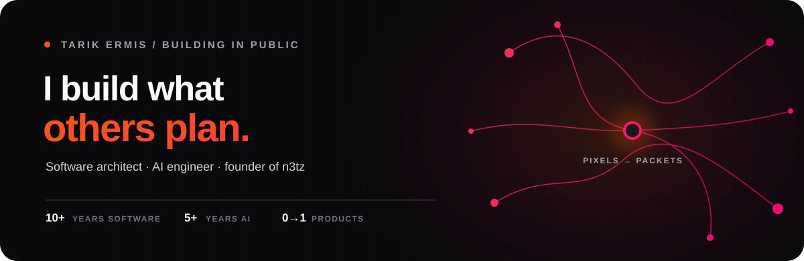
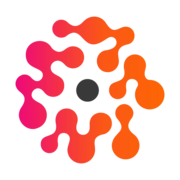
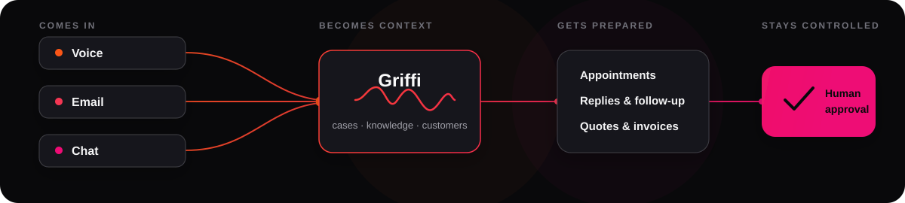

  

  <a href="https://tarikermis.com">Portfolio</a>
  &nbsp;·&nbsp;
  <a href="https://n3tz.ai">n3tz</a>
  &nbsp;·&nbsp;
  <a href="https://www.linkedin.com/in/tarikermis/">LinkedIn</a>
  &nbsp;·&nbsp;
  <a href="mailto:tarik@n3tz.ai">Email</a>

I build production AI systems and full-stack products—from realtime voice agents to the infrastructure that keeps them running. I like the part where product thinking, difficult engineering, and real operations meet.

## Currently building: Griffi by n3tz

<table>
  <tr>
    <td width="76%" valign="top">
      <h3>The AI coworker for trades and local businesses.</h3>
      
Griffi receives calls and messages, connects them with business context, and prepares appointments, quotes, invoices, and follow-up. The consequential steps stay visible, reviewable, and under human control.

      
I’m building the product end to end: direction, UX, multi-tenant platform, realtime voice, AI orchestration, infrastructure, security, and the release system.

      
<a href="https://n3tz.ai"><strong>Meet Griffi →</strong></a>

    </td>
    <td width="24%" align="center" valign="middle">
      
    </td>
  </tr>
</table>

  

## From model to metal

<table>
  <tr>
    <td width="33%" valign="top">
      <h3>AI systems</h3>
      
Conversational AI, retrieval, tool use, evaluation, guardrails, and realtime voice—designed around useful behavior, not a model demo.

    </td>
    <td width="33%" valign="top">
      <h3>Product engineering</h3>
      
I move between interface, API, data model, and business workflow to turn ambiguous ideas into coherent products.

    </td>
    <td width="34%" valign="top">
      <h3>Production operations</h3>
      
Containers, infrastructure, observability, security, backups, and guarded releases are part of the product—not an afterthought.

    </td>
  </tr>
</table>

`TypeScript` · `Python` · `React` · `Next.js` · `PostgreSQL` · `LiveKit` · `Docker` · `Cloudflare` · `Hetzner`

Most of the n3tz code is private because it runs a real product. The [n3tz site](https://n3tz.ai) shows the outcome; my [portfolio](https://tarikermis.com) goes deeper into the work behind it.

  <strong>Have a difficult problem?</strong> 
  <a href="mailto:tarik@n3tz.ai">Send me the rough version.</a>

